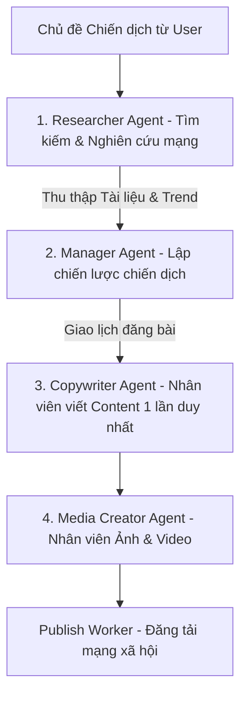
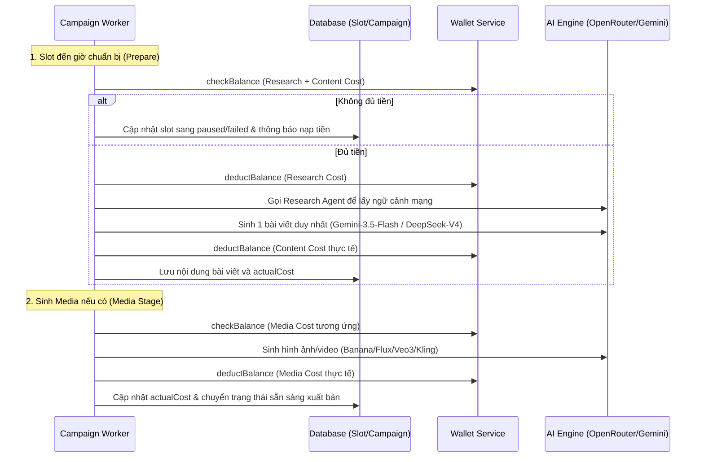

# Tài Liệu Thiết Kế: Hệ Thống AI Agent & Cơ Chế Tính Phí Tối Ưu (Thời điểm: Năm 2026)

Tài liệu này đặc tả chi tiết kiến trúc phòng ban AI (Manager-Worker model), vai trò của từng Agent, các mô hình AI thế hệ mới nhất được áp dụng tại thời điểm **năm 2026** (Gemini 3.5 Flash, Gemini 2.5 Flash, Qwen 3.6 Flash, Veo 3, Seedance 2.0, Nano-Banana và Flux), chiến lược sao lưu (fallback), và bảng giá dịch vụ (Credit Billing) theo quy trình đơn giản hóa: **Chỉ sinh bài viết một lần duy nhất (không lặp candidates, không chấm điểm/so sánh chéo)** để tối ưu hóa thời gian và chi phí.

---

## 1. Cơ Cấu Tổ Chức Phòng Ban AI & Vai Trò Các Agents (2026 Agent Architecture)

Hệ thống sản xuất chiến dịch marketing tự động vận hành theo quy trình tuyến tính tinh gọn (Single-Render Flow):

### 1.1. Agent Tìm Kiếm & Nghiên Cứu (Researcher Agent)
*   **Nhiệm vụ**: Nhận chủ đề/brief ban đầu từ người dùng. Lên mạng Internet tìm kiếm các tài liệu, bài báo, bài viết liên quan, quét xu hướng thị trường và gom các tài liệu/ngữ cảnh chất lượng nhất mang về phục vụ chủ đề.
*   **Mô hình sử dụng**: 
    *   *Mô hình chính (Primary)*: `google/gemini-3.5-flash` (tích hợp Web Search Grounding).
    *   *Mô hình sao lưu (Fallback)*: `qwen/qwen-3.6-flash`.
*   **Công cụ hỗ trợ**: Google Search API, Firecrawl API, Vector DB (PgVector/ChromaDB).

### 1.2. Trưởng Phòng Marketing AI (Marketing Manager Agent)
*   **Nhiệm vụ**:
    *   **Lập chiến lược (Strategy Planning)**: Phân tích tài liệu do Researcher Agent mang về, định hình chân dung khách hàng, lên danh sách các Content Pillars và lập lịch đăng chi tiết (slots).
    *   *Lưu ý*: Để tối ưu chi phí, Trưởng phòng AI chỉ làm nhiệm vụ hoạch định ban đầu, **không thực hiện chấm điểm hoặc so sánh chéo** các phương án viết bài nữa. Bài viết từ Copywriter Agent sẽ được sinh thẳng và chuyển tiếp trực tiếp sang bộ phận Media.
*   **Mô hình sử dụng**:
    *   *Mô hình chính (Primary)*: `google/gemini-2.5-flash`.
    *   *Mô hình sao lưu (Fallback)*: `qwen/qwen-3.6-flash`.

### 1.3. Nhân Viên Lên Nội Dung (Copywriter Agent)
*   **Nhiệm vụ**: Nhận định hướng từ Trưởng phòng và tài liệu nghiên cứu để viết bài chi tiết trực tiếp cho từng slot của chiến dịch. **Chỉ sinh 1 phương án duy nhất (Single Variant)**, không sinh nhiều candidate để chọn lọc như trước.
*   **Mô hình sử dụng**:
    *   *Chế độ Premium (Cao cấp)*: `google/gemini-3.5-flash`.
    *   *Chế độ Budget (Tối ưu chi phí)*: `qwen/qwen-3.6-flash` hoặc `deepseek/deepseek-v4`.
    *   *Mô hình sao lưu (Fallback)*: `qwen/qwen-3.6-flash` hoặc `google/gemini-3.5-flash`.

### 1.4. Nhân Viên Đa Phương Tiện (Media Creator Agent)
*   **Nhiệm vụ**: Dựa trên mô tả hình ảnh/video (mediaPrompt) của bài đăng duy nhất được tạo ra để sinh ảnh hoặc video tương ứng.
*   **Mô hình tạo Ảnh (Image generation)**:
    *   *Chế độ Premium*: `google/gemini-banana-pro` (hoặc Imagen 3 Pro).
    *   *Chế độ Budget*: `piapi/nano-banana-pro` hoặc `black-forest-labs/flux-2-schnell`.
*   **Mô hình tạo Video (Video generation)**:
    *   *Chế độ Premium*: `google/veo-3` hoặc `seedance/seedance-2.0`.
    *   *Chế độ Budget*: `kling/kling-1.5-standard` hoặc `minimax/video-02`.

---

## 2. Giá Tiền Chính Thức Từ Nhà Cung Cấp vs. Chi Phí Hệ Thống (Unit Cost Per Request)

Đơn vị tính toán: **Credit**. Tỷ giá quy đổi mặc định: `1 Credit = 100 VND`. Giá USD quy đổi: `1 USD = 25,000 VND`.

### 2.1. Bảng Giá Chi Tiết Theo Request (Không còn phí Chấm điểm)

| Tác Vụ (Task) | Agent Phụ Trách | Mô Hình Chính Áp Dụng (2026) | Ước Lượng Token / Quy Cách mỗi Request | Giá Gốc Nhà Cung Cấp (USD) | Giá Gốc Quy Đổi (VND) | Phí Hệ Thống (Credit) | Phí Hệ Thống (VND) |
| :--- | :--- | :--- | :--- | :---: | :---: | :---: | :---: |
| **Nghiên Cứu Mạng** | Researcher Agent | `gemini-3.5-flash` | 8,000 Input / 2,000 Output + 1 Web Search Query | $0.0059 | **148 VND** | **1.5 cr** | **150 VND** |
| **Lập Lịch Chiến Lược** | Manager Agent | `gemini-2.5-flash` | 50,000 Input / 2,500 Output (Context lớn) | $0.0045 | **112 VND** | **2.5 cr** | **250 VND** |
| **Viết Content (Premium)**| Copywriter Agent | `gemini-3.5-flash` | 4,000 Input / 1,500 Output | $0.0009 | **22 VND** | **2.5 cr** | **250 VND** |
| **Viết Content (Budget)** | Copywriter Agent | **qwen-3.6-flash** / **DeepSeek-V4** | 4,000 Input / 1,500 Output | $0.0005 | **12 VND** | **0.5 cr** | **50 VND** |
| **Tạo Ảnh (Premium)** | Media Agent | `gemini-banana-pro` | 1 ảnh chất lượng cao (1K) | $0.0300 | **750 VND** | **27.5 cr** | **2,750 VND** |
| **Tạo Ảnh (Budget)** | Media Agent | **nano-banana-pro** / **Flux 2 Schnell** | 1 ảnh tiêu chuẩn (PiAPI) | $0.0030 | **75 VND** | **5.0 cr** | **500 VND** |
| **Tạo Video (Premium)** | Media Agent | `veo-3` / `seedance-2.0` | 1 video chất lượng cao (5 giây) | $1.5000 | **37,500 VND** | **400.0 cr** | **40,000 VND** |
| **Tạo Video (Budget)** | Media Agent | **Kling 1.5 Standard** | 1 video thô minh họa (5 giây) | $0.1000 | **2,500 VND** | **30.0 cr** | **3,000 VND** |

---

## 3. Dự Toán Tổng Chi Phí Trong Quá Trình Phát Triển (Development Phase Budget Plan)

Do bỏ bước lặp candidates và chấm điểm chéo, chi phí phát triển và kiểm thử giảm đi đáng kể.

### 3.1. Quy mô kiểm thử dự kiến (Testing Scope):
*   **Tạo chiến dịch mẫu**: 50 lần lập chiến lược (`Strategy Planning`).
*   **Xử lý bài viết**: 200 slot chạy qua worker (chỉ tạo đúng 1 bài viết duy nhất cho mỗi slot, không chấm điểm).
*   **Sinh ảnh mẫu**: 50 ảnh thô.
*   **Sinh video mẫu**: 10 video ngắn.

### 3.2. Bảng Dự Toán Ngân Sách Kiểm Thử Đơn Giản Hóa

| Tác Vụ Kiểm Thử (Testing Task) | Số Lượng Lượt Chạy | Chi Phí Theo Chế Độ Premium (Credit / VND) | Chi Phí Theo Chế Độ Budget (Credit / VND) | Ghi Chú Kỹ Thuật |
| :--- | :---: | :--- | :--- | :--- |
| **Nghiên cứu tài liệu (RAG)** | 200 lượt | 300 cr / **30,000 VND** | 300 cr / **30,000 VND** | Gọi thử nghiệm RAG search |
| **Lập chiến lược chiến dịch** | 50 lượt | 125 cr / **12,500 VND** | 125 cr / **12,500 VND** | Sinh pillars và lịch slots |
| **Viết Content (1 variant)** | 200 lượt | 500 cr / **50,000 VND** | 100 cr / **10,000 VND** | 200 slots $\times$ 1 bài viết duy nhất |
| **Tạo hình ảnh mẫu** | 50 ảnh | 1,375 cr / **137,500 VND** | 250 cr / **25,000 VND** | Kiểm thử tạo ảnh và CDN |
| **Tạo video mẫu** | 10 video | 4,000 cr / **400,000 VND** | 300 cr / **30,000 VND** | Thử nghiệm ghép FFmpeg/Remotion |
| **TỔNG CỘNG CHI PHÍ DEV** | | **6,300 cr / 630,000 VND** | **1,075 cr / 107,500 VND** | ~25.2 USD (Premium) vs ~4.3 USD (Budget) |

---

## 4. Công Thức Tính Toán Chi Phí Chiến Dịch Ước Tính (Cost Estimation Formula)

Khi người dùng thiết lập chiến dịch, Frontend sẽ tính toán chi phí lớn nhất dự kiến theo công thức đơn giản hóa:

$$\text{Tổng Chi Phí Ước Tính} = P_{plan} + N \times \left( P_{research} + P_{content} + P_{media} \right)$$

*Trong đó:*
*   $N$: Tổng số slot đăng bài (`totalSlots`).
*   $P_{research} = 1.5$ (Phí Nghiên cứu mạng & RAG).
*   $P_{plan} = 2.5$ (Phí Lập chiến dịch của Trưởng phòng).
*   $P_{content}$: Premium ($2.5$) hoặc Budget (Chinese Model - $0.5$).
*   $P_{media}$: Tùy theo mediaPolicy (Text = 0, Image = Premium $27.5$ / Budget $5.0$, Video = Premium $400.0$ / Budget $30.0$, Auto = tính theo giá trị của ảnh).

---

## 5. Luồng Nghiệp Vụ Khấu Trừ Giao Dịch Trong Worker (Worker Financial Flow)

Quy trình chạy ngầm của Worker được rút gọn tối đa:

